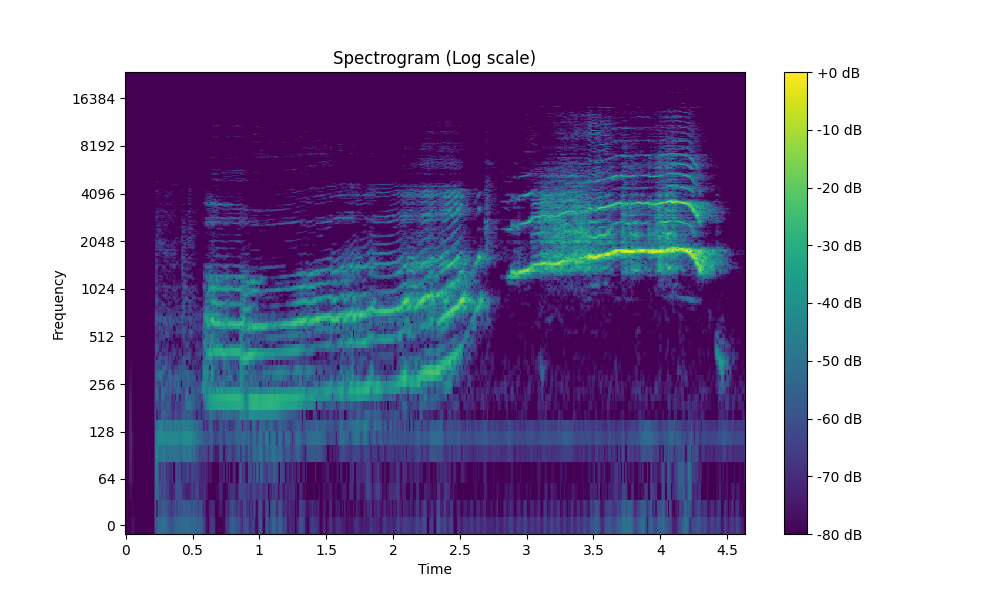

# Лабораторная работа №10. Обработка голоса

## Спектрограммы
### А

### И

### Мяу

## Минимальные и максимальные частоты

### А
- Minimum frequency: 187.5 Hz
- Maximum frequency: 7335.9375 Hz

### И
- Minimum frequency: 117.1875 Hz
- Maximum frequency: 5718.75 Hz

### Мяу
- Minimum frequency: 0.0 Hz
- Maximum frequency: 5601.5625 Hz
- 
## Наиболее тембрально окрашенный основной тон

### А

Frequency with most harmonics: 23.4375 Hz

### И

Frequency with most harmonics: 23.4375 Hz

### Мяу

Frequency with most harmonics: 23.4375 Hz

## Три самые сильные форманты для издаваемых звуков

### А
- 974.845467032967 Hz
- 961.9677197802198 Hz
- 979.4814560439561 Hz

### И
- 832.7872983870968 Hz
- 813.6970766129032 Hz
- 833.1653225806451 Hz

### Мяу
- 623.2638888888889 Hz
- 635.9953703703703 Hz
- 543.4027777777778 Hz
