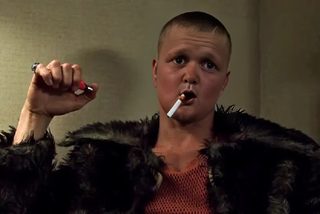

# Лабораторная работа №1. Передискретизация изображений

Реализовна передискретизация методом ближайшего соседа

## Исходное изображение для всех пунктов задания

Исходное изображение:

### Растяжение (интерполяция) изображения в M раз

Увеличенное в 2 раза изображение:

При приближении можно заметить образовашиеся "лесенки" на границах объектов:

### Сжатие (децимация) изображения в N раз

Сжатое в 2 раза изображение:

Так же можно заметить "лесенки":

### Передискретизация в K=M/N раз путём растяжения и последующего сжатия (в два прохода)

Передискретизация в 3/4 раза:

Так же можно заметить "лесенки":

### Передискретизация изображения в K раз за один проход

Передискретизация в 1/2 раза:

Так же можно заметить "лесенки", однако, по сравнению с реализацией в два прохода, они выражены в меньшей степени:

