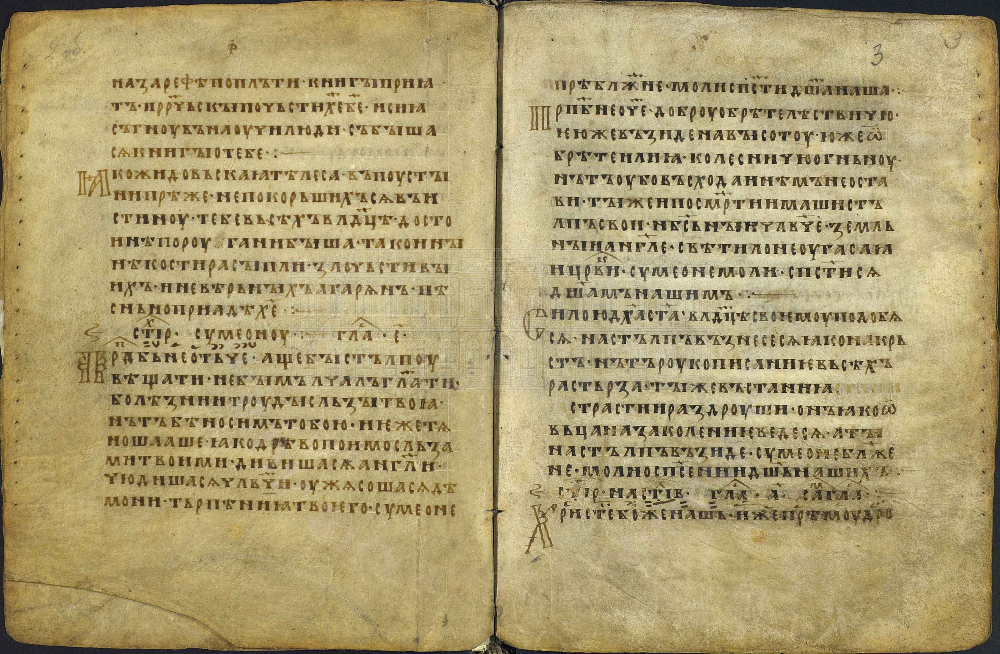
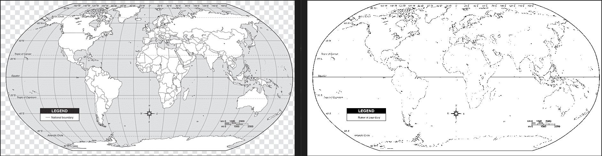
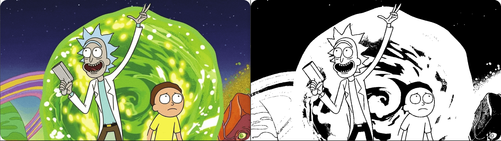
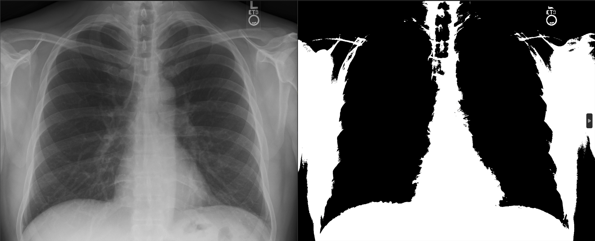
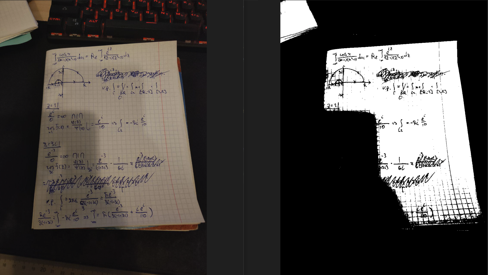
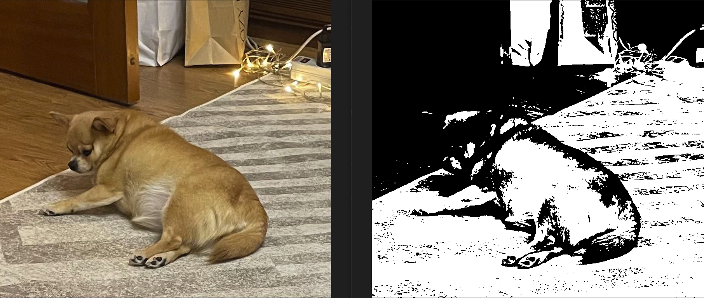

# Лабораторная работа №2. Обесцвечивание и бинаризация растровых изображений

## П.1 Приведение к полутону

Исходное изображение:

После приведения к полутону:

## П.2 Бинаризация алгоритмом сбалансированного порогового отсечения гистограммы

Можно заметить, что алгоритм не создает шума и хорошо справляется с равномерно освещенными изображениями, с случаях же наличия затемненных частей безжалостно обращет их в черный