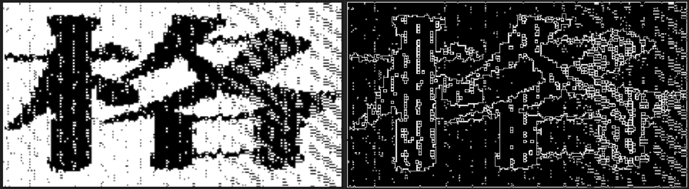

# Лабораторная работа №2. Обесцвечивание и бинаризация растровых изображений

Исходные изображения:

## Результаты филтьтрации методом консервативного сглаживания
Слева - отфильтрованное монохромное (полутоновое) изображение, справа - разностное изображение.

Для различных значений размера окна:

3:

5:

7:

