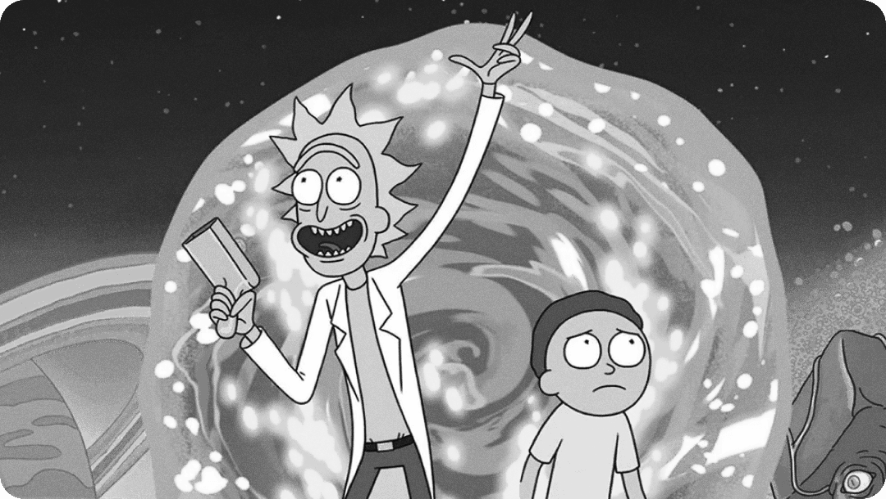
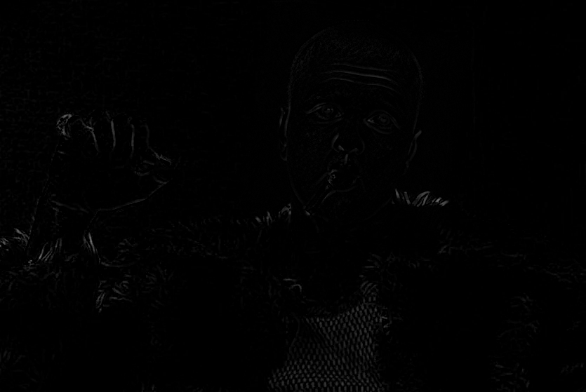

# Лабораторная работа №4. Выделение контуров на изображении

Исходные изображения:

Полутоновые изображения:

Разность исходного и морфологически расширенного изображения (черного):

Бинаризация:

## Вывод
Алгоритм хорошо справляется с векторными изображениями и рукописным текстом, но плохо с фотографиями людей.