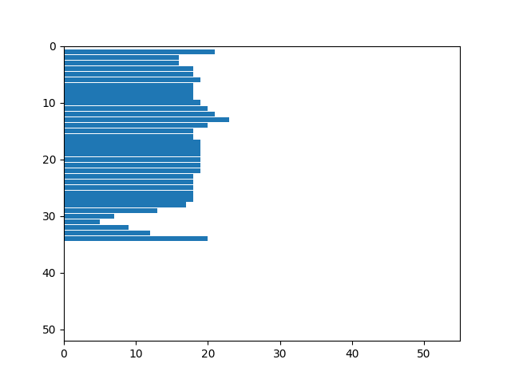
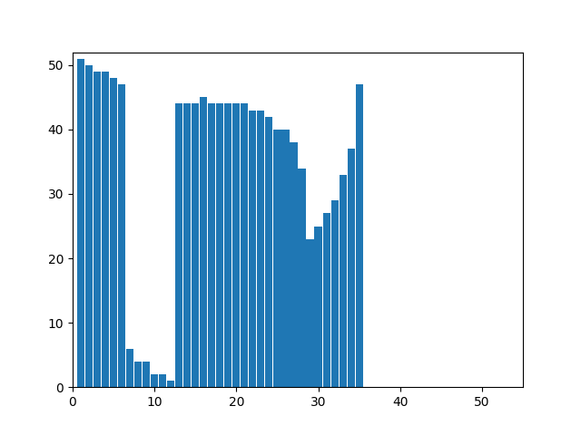
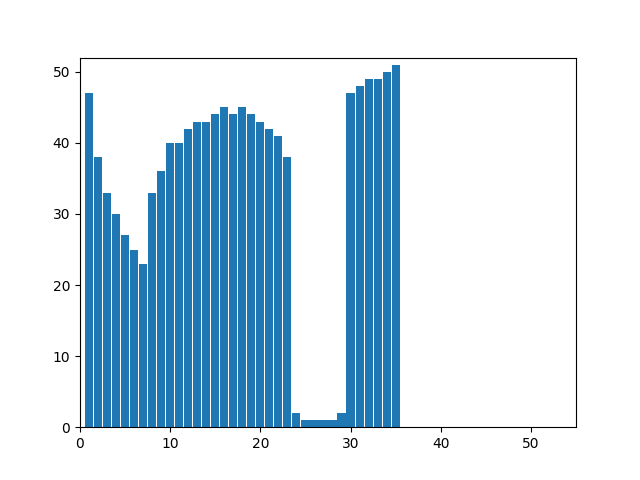
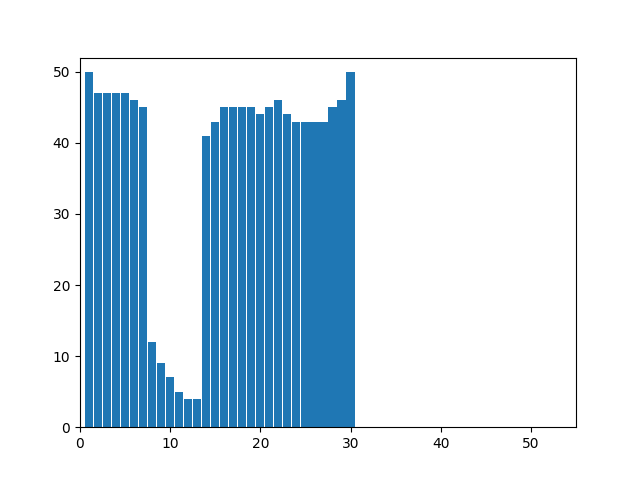
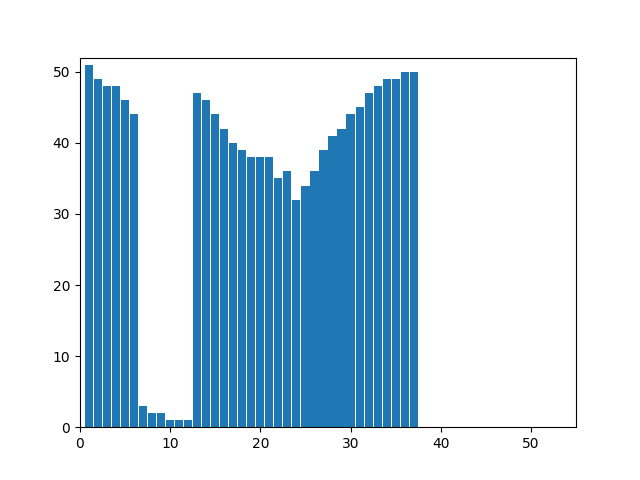
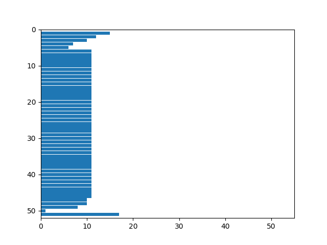
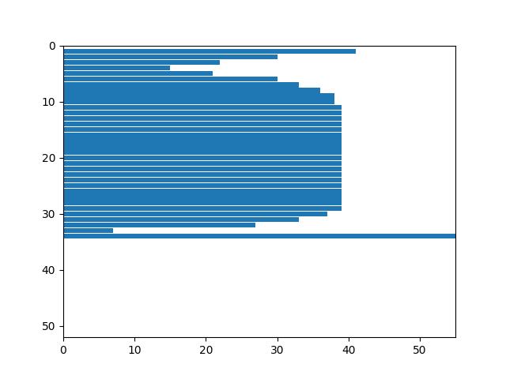
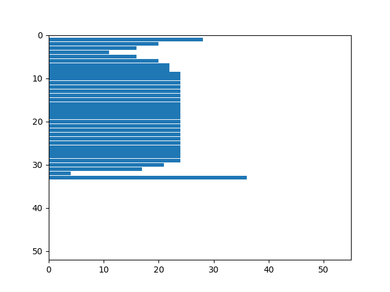
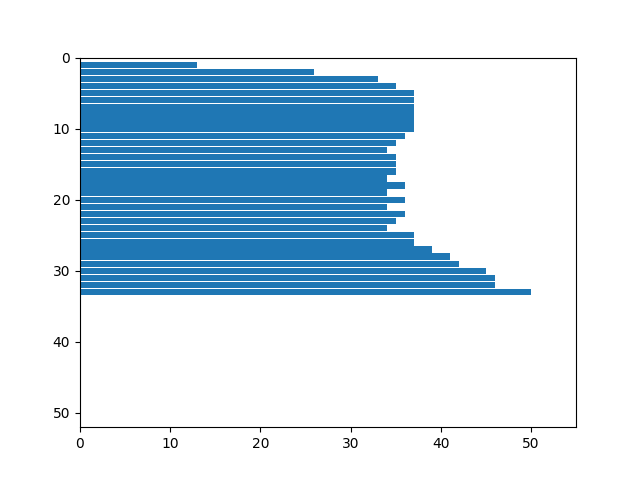
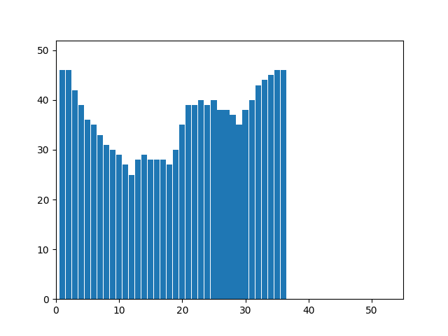

# Лабораторная работа №5. Выделение признаков символов.
## Буква a

  

Признаки:
- Вес чёрного = 432.0
- Нормированный вес чёрного = 0.4381338742393509
- Центр масс = (14.222222222222221, 18.95138888888889)
- Нормированный центр масс = (0.4722222222222222, 0.5439814814814815)
- Моменты инерции = (45561.97916666667, 26558.666666666668)
- Нормированные моменты инерции = (22.81521240193624, 13.299282256718412)

## Буква b

  

Признаки:
- Вес чёрного = 574.0
- Нормированный вес чёрного = 0.33102652825836215
- Центр масс = (16.538327526132406, 28.407665505226483)
- Нормированный центр масс = (0.4708584098828002, 0.5481533101045296)
- Моменты инерции = (101442.60627177703, 52764.65679442509)
- Нормированные моменты инерции = (27.000959880696573, 14.044359008364411)

## Буква c

  

Признаки:
- Вес чёрного = 332.0
- Нормированный вес чёрного = 0.3616557734204793
- Центр масс = (11.671686746987952, 18.042168674698797)
- Нормированный центр масс = (0.41044949026876737, 0.5164293537787514)
- Моменты инерции = (38511.40963855423, 20375.213855421687)
- Нормированные моменты инерции = (20.43045604167333, 10.809132018791345)

## Буква d

  

Признаки:
- Вес чёрного = 597.0
- Нормированный вес чёрного = 0.34429065743944637
- Центр масс = (18.721943048576215, 30.515912897822446)
- Нормированный центр масс = (0.5370285772295823, 0.5903182579564489)
- Моменты инерции = (118101.09882747072, 53709.842546063635)
- Нормированные моменты инерции = (31.43494778479391, 14.2959389262879)

## Буква e

  

Признаки:
- Вес чёрного = 384.0
- Нормированный вес чёрного = 0.41830065359477125
- Центр масс = (12.731770833333334, 18.041666666666668)
- Нормированный центр масс = (0.4512219551282052, 0.5164141414141414)
- Моменты инерции = (40119.333333333336, 24241.372395833336)
- Нормированные моменты инерции = (21.28346595932803, 12.860144507073388)

## Буква f

  

Признаки:
- Вес чёрного = 374.0
- Нормированный вес чёрного = 0.2725947521865889
- Центр масс = (11.970588235294118, 23.946524064171122)
- Нормированный центр масс = (0.40631808278867104, 0.4780525846702317)
- Моменты инерции = (84216.93048128343, 12256.676470588236)
- Нормированные моменты инерции = (26.44173641484566, 3.848250069258473)

## Буква g

  

Признаки:
- Вес чёрного = 608.0
- Нормированный вес чёрного = 0.3838383838383838
- Центр масс = (16.27467105263158, 24.893092105263158)
- Нормированный центр масс = (0.47733347039473684, 0.5083636618141097)
- Моменты инерции = (125974.05098684212, 46553.12993421053)
- Нормированные моменты инерции = (37.127630706407935, 13.720344808196442)

## Буква h

  

Признаки:
- Вес чёрного = 566.0
- Нормированный вес чёрного = 0.32342857142857145
- Центр масс = (15.826855123674912, 29.268551236749115)
- Нормированный центр масс = (0.4360839742257327, 0.5769092089132473)
- Моменты инерции = (108719.18021201412, 48099.03180212013)
- Нормированные моменты инерции = (29.18635710389641, 12.912491758958424)

## Буква i

  

Признаки:
- Вес чёрного = 255.0
- Нормированный вес чёрного = 0.31875
- Центр масс = (8.486274509803922, 30.356862745098038)
- Нормированный центр масс = (0.4990849673202614, 0.5991196478591436)
- Моменты инерции = (51806.52549019607, 1305.7019607843145)
- Нормированные моменты инерции = (18.797723327357065, 0.4737670394718122)

## Буква j

  

Признаки:
- Вес чёрного = 351.0
- Нормированный вес чёрного = 0.28421052631578947
- Центр масс = (14.501424501424502, 37.86894586894587)
- Нормированный центр масс = (0.7500791389680279, 0.5760772792022792)
- Моменты инерции = (115929.97150997148, 6345.749287749287)
- Нормированные моменты инерции = (25.279104123412882, 1.3837220426841008)

## Буква k

  

Признаки:
- Вес чёрного = 542.0
- Нормированный вес чёрного = 0.3011111111111111
- Центр масс = (14.00369003690037, 30.256457564575644)
- Нормированный центр масс = (0.3715340010542963, 0.5970705625423601)
- Моменты инерции = (109295.35239852397, 32785.992619926204)
- Нормированные моменты инерции = (28.792242465364588, 8.636984357198685)

## Буква l

  

Признаки:
- Вес чёрного = 320.0
- Нормированный вес чёрного = 0.3764705882352941
- Центр масс = (8.446875, 26.34375)
- Нормированный центр масс = (0.4654296875, 0.517219387755102)
- Моменты инерции = (72378.1875, 1545.0968750000002)
- Нормированные моменты инерции = (25.951304230907134, 0.5539967282179994)

## Буква m

  

Признаки:
- Вес чёрного = 699.0
- Нормированный вес чёрного = 0.3851239669421488
- Центр масс = (27.267525035765377, 16.61659513590844)
- Нормированный центр масс = (0.48643564881046997, 0.48801859799713876)
- Моменты инерции = (76705.24749642347, 174918.97281831186)
- Нормированные моменты инерции = (18.64493133116759, 42.51798075311421)

## Буква n

  

Признаки:
- Вес чёрного = 451.0
- Нормированный вес чёрного = 0.40267857142857144
- Центр масс = (17.490022172949, 16.534368070953438)
- Нормированный центр масс = (0.4850006521455588, 0.5011086474501109)
- Моменты инерции = (44752.217294900234, 39960.70509977827)
- Нормированные моменты инерции = (19.898718228057017, 17.76821036006148)

## Буква ñ

  

Признаки:
- Вес чёрного = 552.0
- Нормированный вес чёрного = 0.33556231003039516
- Центр масс = (17.47826086956522, 26.67753623188406)
- Нормированный центр масс = (0.4846547314578005, 0.5582073093887839)
- Моменты инерции = (103388.60144927539, 43437.73913043478)
- Нормированные моменты инерции = (30.10733880293401, 12.649312501582637)

## Буква o

  

Признаки:
- Вес чёрного = 412.0
- Нормированный вес чёрного = 0.3786764705882353
- Центр масс = (16.320388349514563, 17.410194174757283)
- Нормированный центр масс = (0.49420607579079234, 0.4972786113562813)
- Моменты инерции = (38027.67718446602, 41621.70873786408)
- Нормированные моменты инерции = (17.44388861672753, 19.09252694397435)

## Буква p

  

Признаки:
- Вес чёрного = 587.0
- Нормированный вес чёрного = 0.3596813725490196
- Центр масс = (16.550255536626917, 21.12265758091993)
- Нормированный центр масс = (0.4712198647462702, 0.42814165065787085)
- Моменты инерции = (109569.16865417376, 54619.26746166951)
- Нормированные моменты инерции = (31.667389784443284, 15.785915451349569)

## Буква q

  

Признаки:
- Вес чёрного = 560.0
- Нормированный вес чёрного = 0.3431372549019608
- Центр масс = (18.544642857142858, 22.90714285714286)
- Нормированный центр масс = (0.5316558441558442, 0.4661094224924012)
- Моменты инерции = (96725.17142857144, 51274.88392857145)
- Нормированные моменты инерции = (27.955251857968623, 14.81933061519406)

## Буква r

  

Признаки:
- Вес чёрного = 280.0
- Нормированный вес чёрного = 0.3689064558629776
- Центр масс = (10.307142857142857, 14.957142857142857)
- Нормированный центр масс = (0.42305194805194807, 0.4361607142857143)
- Моменты инерции = (31001.485714285714, 6479.585714285713)
- Нормированные моменты инерции = (19.160374359879924, 4.004688327741479)

## Буква s

  

Признаки:
- Вес чёрного = 312.0
- Нормированный вес чёрного = 0.4369747899159664
- Центр масс = (10.868589743589743, 17.951923076923077)
- Нормированный центр масс = (0.49342948717948715, 0.5136946386946387)
- Моменты инерции = (31702.27884615384, 12711.61217948718)
- Нормированные моменты инерции = (19.851145176051247, 7.9596820159594115)

## Буква t

  

Признаки:
- Вес чёрного = 283.0
- Нормированный вес чёрного = 0.3463892288861689
- Центр масс = (9.265017667844523, 23.434628975265017)
- Нормированный центр масс = (0.45916764821358463, 0.5341578327444052)
- Моменты инерции = (40045.5406360424, 2639.1236749116606)
- Нормированные моменты инерции = (18.12015413395584, 1.1941736085573125)

## Буква u

  

Признаки:
- Вес чёрного = 448.0
- Нормированный вес чёрного = 0.3771043771043771
- Центр масс = (19.035714285714285, 17.424107142857142)
- Нормированный центр масс = (0.5153061224489796, 0.5132533482142857)
- Моменты инерции = (45621.41964285714, 42161.428571428565)
- Нормированные моменты инерции = (19.12847783767595, 17.67774782869122)

## Буква v

  

Признаки:
- Вес чёрного = 287.0
- Нормированный вес чёрного = 0.2557932263814617
- Центр масс = (16.37630662020906, 13.902439024390244)
- Нормированный центр масс = (0.46594868546088064, 0.4032012195121951)
- Моменты инерции = (23879.268292682926, 15719.358885017424)
- Нормированные моменты инерции = (10.636645119235157, 7.001941596889721)

## Буква w

  

Признаки:
- Вес чёрного = 515.0
- Нормированный вес чёрного = 0.30600118835412954
- Центр масс = (24.392233009708736, 14.460194174757282)
- Нормированный центр масс = (0.4678446601941747, 0.42063106796116506)
- Моменты инерции = (41901.93398058253, 75010.76893203883)
- Нормированные моменты инерции = (11.355537664114507, 20.32812166179914)

## Буква x

  

Признаки:
- Вес чёрного = 362.0
- Нормированный вес чёрного = 0.3327205882352941
- Центр масс = (17.013812154696133, 16.359116022099446)
- Нормированный центр масс = (0.48526703499079193, 0.49545535555159503)
- Моменты инерции = (40249.31491712706, 20034.93093922652)
- Нормированные моменты инерции = (18.462988494094983, 9.190335293223175)

## Буква y

  

Признаки:
- Вес чёрного = 393.0
- Нормированный вес чёрного = 0.2322695035460993
- Центр масс = (16.244274809160306, 20.201017811704833)
- Нормированный центр масс = (0.4355507088331516, 0.41741343068923553)
- Моменты инерции = (82567.11959287529, 24128.549618320612)
- Нормированные моменты инерции = (23.556952808238314, 6.884036980975924)

## Буква z

  

Признаки:
- Вес чёрного = 343.0
- Нормированный вес чёрного = 0.3572916666666667
- Центр масс = (15.909620991253645, 16.68804664723032)
- Нормированный центр масс = (0.514124861767367, 0.5060660208783974)
- Моменты инерции = (42559.62099125364, 19888.198250728863)
- Нормированные моменты инерции = (22.120385130589213, 10.336901377717703)
