# Лабораторная работа №5. Выделение признаков символов. 
Испанские строчные буквы Times New Roman 52
## Буква a

 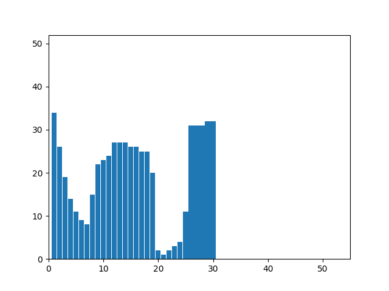 

Признаки:
- Вес чёрного = 588.0
- Нормированный вес чёрного = 0.5764705882352941
- Центр масс = (15.704081632653061, 16.433673469387756)
- Нормированный центр масс = (0.5070372976776918, 0.467687074829932)
- Моменты инерции = (51034.413265306124, 49798.510204081635)
- Нормированные моменты инерции = (24.82218544032399, 24.22106527435877)

## Буква b

  

Признаки:
- Вес чёрного = 1211.0
- Нормированный вес чёрного = 0.6784313725490196
- Центр масс = (18.218827415359208, 24.858794384805947)
- Нормированный центр масс = (0.5064361004517414, 0.47717588769611896)
- Моменты инерции = (280402.85383980174, 129125.01073492983)
- Нормированные моменты инерции = (73.28877518029319, 33.74934938184261)

## Буква c

  

Признаки:
- Вес чёрного = 620.0
- Нормированный вес чёрного = 0.6512605042016807
- Центр масс = (15.479032258064516, 17.20967741935484)
- Нормированный центр масс = (0.5362604540023894, 0.4912023460410557)
- Моменты инерции = (52968.741935483864, 40038.72741935484)
- Нормированные моменты инерции = (27.30347522447622, 20.638519288327235)

## Буква d

  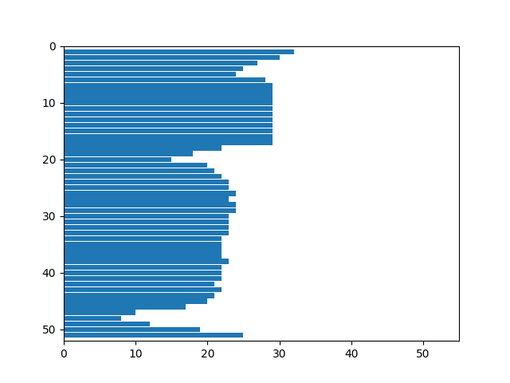

Признаки:
- Вес чёрного = 1188.0
- Нормированный вес чёрного = 0.6655462184873949
- Центр масс = (17.637205387205388, 23.73063973063973)
- Нормированный центр масс = (0.48932957021192314, 0.4546127946127946)
- Моменты инерции = (250355.80471380474, 127892.63552188558)
- Нормированные моменты инерции = (65.43539067271425, 33.427243994219964)

## Буква e

  

Признаки:
- Вес чёрного = 568.0
- Нормированный вес чёрного = 0.5966386554621849
- Центр масс = (15.019366197183098, 17.133802816901408)
- Нормированный центр масс = (0.5192357850808554, 0.48890311566367906)
- Моменты инерции = (51321.830985915476, 37496.78697183099)
- Нормированные моменты инерции = (26.454552054595606, 19.328240707129375)

## Буква f

  

Признаки:
- Вес чёрного = 1126.0
- Нормированный вес чёрного = 0.7506666666666667
- Центр масс = (16.340142095914743, 26.015985790408525)
- Нормированный центр масс = (0.5289704171005084, 0.5105303222532352)
- Моменты инерции = (226955.7122557727, 96930.72557726466)
- Нормированные моменты инерции = (66.75168007522727, 28.509036934489608)

## Буква g

  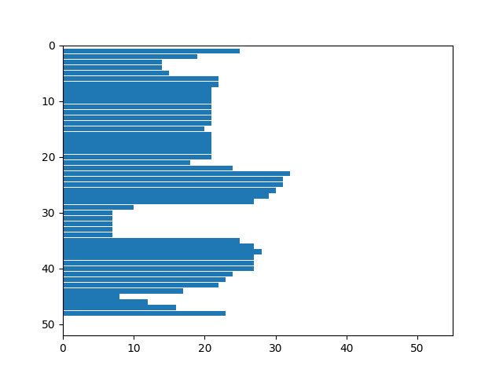

Признаки:
- Вес чёрного = 976.0
- Нормированный вес чёрного = 0.6161616161616161
- Центр масс = (17.451844262295083, 24.255122950819672)
- Нормированный центр масс = (0.5141201331967213, 0.4947898500174398)
- Моменты инерции = (177869.4743852459, 96543.73668032786)
- Нормированные моменты инерции = (52.422479924917745, 28.45379801954844)

## Буква h

  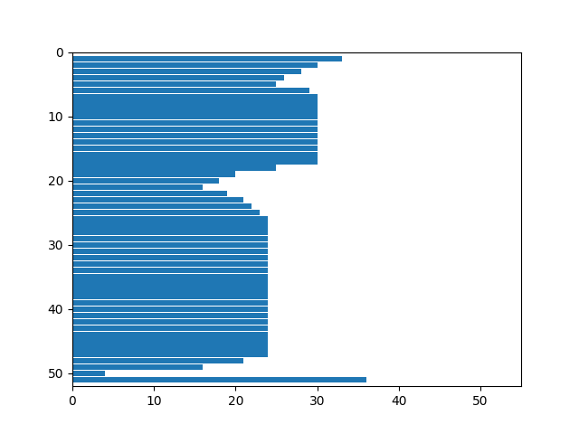

Признаки:
- Вес чёрного = 1270.0
- Нормированный вес чёрного = 0.6917211328976035
- Центр масс = (19.245669291338583, 24.543307086614174)
- Нормированный центр масс = (0.5213048368953881, 0.47086614173228347)
- Моменты инерции = (280339.11811023613, 147745.35118110236)
- Нормированные моменты инерции = (71.93716143449734, 37.912586908160726)

## Буква i

  

Признаки:
- Вес чёрного = 612.0
- Нормированный вес чёрного = 0.7058823529411765
- Центр масс = (9.2140522875817, 24.184640522875817)
- Нормированный центр масс = (0.5133782679738562, 0.46369281045751637)
- Моменты инерции = (129186.13562091501, 19406.9591503268)
- Нормированные моменты инерции = (44.70108498993599, 6.715210778659792)

## Буква j

  

Признаки:
- Вес чёрного = 1014.0
- Нормированный вес чёрного = 0.7428571428571429
- Центр масс = (9.44181459566075, 31.314595660749507)
- Нормированный центр масс = (0.4220907297830375, 0.47366555719921105)
- Моменты инерции = (353348.64398422104, 34130.06706114397)
- Нормированные моменты инерции = (75.72838490874861, 7.314630746066003)

## Буква k

  

Признаки:
- Вес чёрного = 1345.0
- Нормированный вес чёрного = 0.7127715951245363
- Центр масс = (20.610408921933086, 24.284758364312268)
- Нормированный центр масс = (0.544733581164808, 0.4656951672862453)
- Моменты инерции = (285777.9375464684, 170187.85427509295)
- Нормированные моменты инерции = (71.98436714016836, 42.86847714737858)

## Буква l

  

Признаки:
- Вес чёрного = 547.0
- Нормированный вес чёрного = 0.6309111880046137
- Центр масс = (9.323583180987203, 25.79890310786106)
- Нормированный центр масс = (0.5202239488117002, 0.49597806215722123)
- Моменты инерции = (115411.87934186471, 19107.725776965268)
- Нормированные моменты инерции = (39.93490634666599, 6.611669819019124)

## Буква m

  

Признаки:
- Вес чёрного = 1205.0
- Нормированный вес чёрного = 0.6328781512605042
- Центр масс = (28.634854771784234, 18.012448132780083)
- Нормированный центр масс = (0.5024519049415315, 0.5155287312963661)
- Моменты инерции = (105692.8132780083, 322441.33609958505)
- Нормированные моменты инерции = (24.625538974372855, 75.12612677063957)

## Буква n

 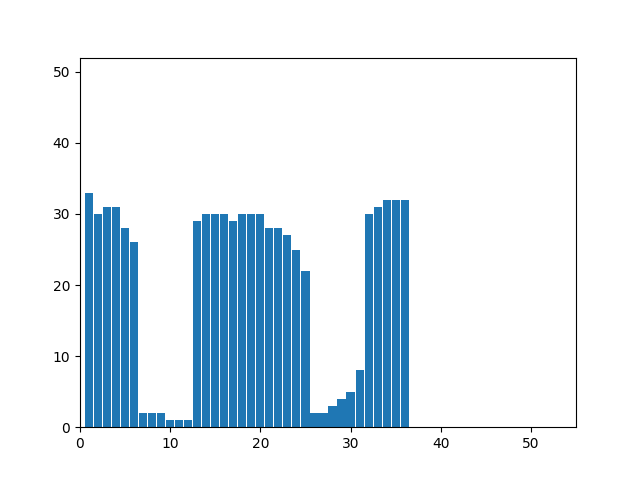 

Признаки:
- Вес чёрного = 737.0
- Нормированный вес чёрного = 0.6203703703703703
- Центр масс = (18.506105834464044, 17.28493894165536)
- Нормированный центр масс = (0.5001744524132584, 0.50890434192673)
- Моменты инерции = (62802.16282225238, 88244.22252374495)
- Нормированные моменты инерции = (26.33214374098632, 36.99967401414882)

## Буква ñ

  

Признаки:
- Вес чёрного = 1176.0
- Нормированный вес чёрного = 0.6805555555555556
- Центр масс = (18.510204081632654, 23.477891156462587)
- Нормированный центр масс = (0.5002915451895044, 0.4782530033289912)
- Моменты инерции = (224397.42517006808, 143041.87755102038)
- Нормированные моменты инерции = (62.33261810279669, 39.73385487528344)

## Буква o

  

Признаки:
- Вес чёрного = 676.0
- Нормированный вес чёрного = 0.6213235294117647
- Центр масс = (16.609467455621303, 17.55473372781065)
- Нормированный центр масс = (0.5035312082458485, 0.5016585978124439)
- Моменты инерции = (66686.974852071, 51108.89940828402)
- Нормированные моменты инерции = (30.590355436729816, 23.444449269855056)

## Буква p

  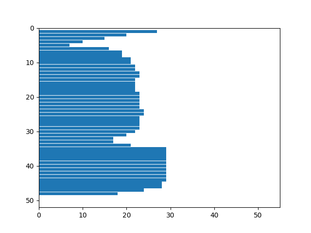

Признаки:
- Вес чёрного = 1093.0
- Нормированный вес чёрного = 0.6505952380952381
- Центр масс = (18.241537053979872, 26.313815187557182)
- Нормированный центр масс = (0.507104030999408, 0.5385918125012167)
- Моменты инерции = (202559.36139066782, 116558.23421774931)
- Нормированные моменты инерции = (57.39851555417054, 33.02868637510607)

## Буква q

  

Признаки:
- Вес чёрного = 1120.0
- Нормированный вес чёрного = 0.6666666666666666
- Центр масс = (17.727678571428573, 25.29642857142857)
- Нормированный центр масс = (0.4919905462184874, 0.5169452887537994)
- Моменты инерции = (223563.58571428567, 119835.94196428572)
- Нормированные моменты инерции = (63.35040683317814, 33.95747859571712)

## Буква r

 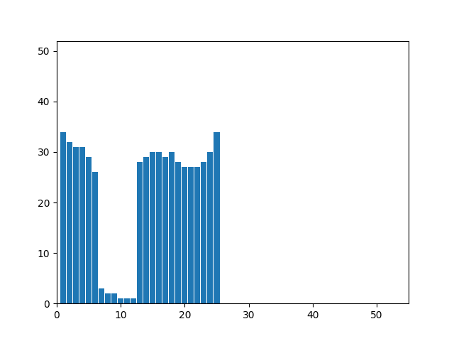 

Признаки:
- Вес чёрного = 570.0
- Нормированный вес чёрного = 0.6705882352941176
- Центр масс = (13.83157894736842, 18.749122807017542)
- Нормированный центр масс = (0.5346491228070175, 0.5378522062732589)
- Моменты инерции = (48111.124561403514, 36523.83157894737)
- Нормированные моменты инерции = (27.013545514544365, 20.507485445787406)

## Буква s

  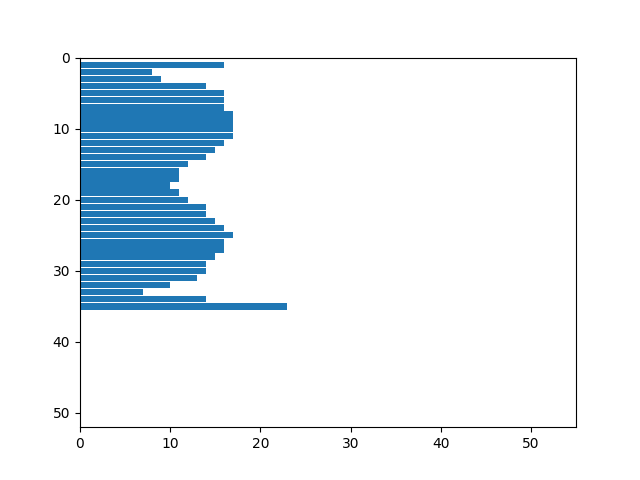

Признаки:
- Вес чёрного = 493.0
- Нормированный вес чёрного = 0.6124223602484472
- Центр масс = (12.08316430020284, 18.030425963488845)
- Нормированный центр масс = (0.5037801954637655, 0.5008948812790837)
- Моменты инерции = (50406.54361054767, 22699.590263691684)
- Нормированные моменты инерции = (28.738052229502664, 12.941613605297425)

## Буква t

  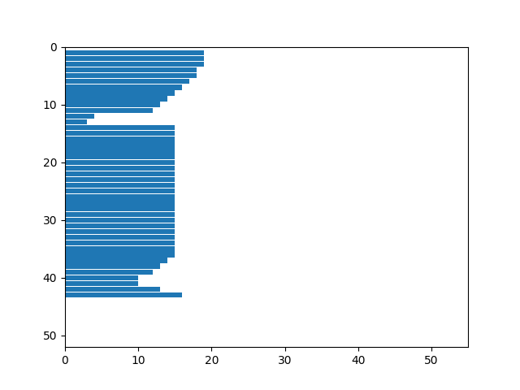

Признаки:
- Вес чёрного = 620.0
- Нормированный вес чёрного = 0.6866002214839424
- Центр масс = (11.335483870967742, 21.34516129032258)
- Нормированный центр масс = (0.5167741935483872, 0.4844086021505376)
- Моменты инерции = (98168.135483871, 30248.219354838715)
- Нормированные моменты инерции = (42.8681814340048, 13.208829412593325)

## Буква u

  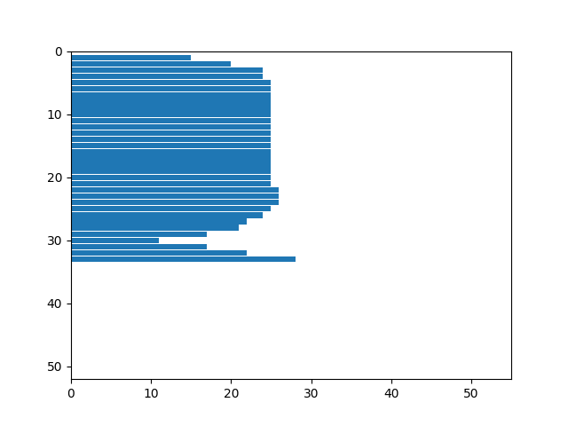

Признаки:
- Вес чёрного = 773.0
- Нормированный вес чёрного = 0.633087633087633
- Центр масс = (18.979301423027167, 16.754204398447605)
- Нормированный центр масс = (0.4994250395285324, 0.49231888745148766)
- Моменты инерции = (64955.29883570505, 97031.66882276842)
- Нормированные моменты инерции = (26.42607763861068, 39.475862010890324)

## Буква v

  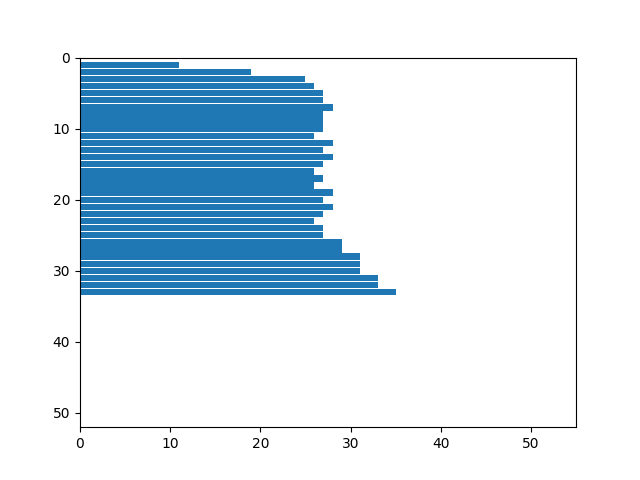

Признаки:
- Вес чёрного = 901.0
- Нормированный вес чёрного = 0.7584175084175084
- Центр масс = (18.85793562708102, 17.986681465038846)
- Нормированный центр масс = (0.5102267322023148, 0.5308337957824639)
- Моменты инерции = (80201.84017758047, 112007.81576026634)
- Нормированные моменты инерции = (33.627605944478184, 46.9634447632144)

## Буква w

 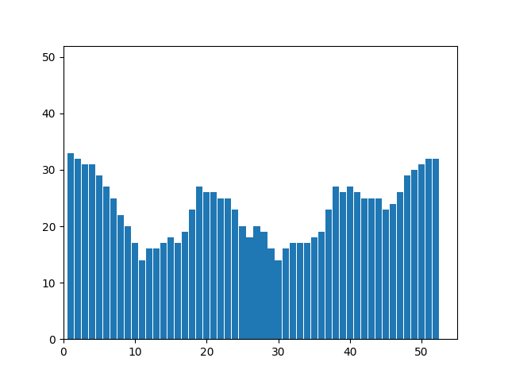 

Признаки:
- Вес чёрного = 1201.0
- Нормированный вес чёрного = 0.6998834498834499
- Центр масс = (26.975020815986678, 18.089092422980848)
- Нормированный центр масс = (0.5093141336467976, 0.5340341382181515)
- Моменты инерции = (108935.46711074105, 310615.25062447955)
- Нормированные моменты инерции = (28.720133696478, 81.89170857486938)

## Буква x

  

Признаки:
- Вес чёрного = 793.0
- Нормированный вес чёрного = 0.6865800865800866
- Центр масс = (18.45018915510719, 17.292559899117276)
- Нормированный центр масс = (0.5132408575031526, 0.5091424968474149)
- Моменты инерции = (64254.12610340479, 97262.28247162674)
- Нормированные моменты инерции = (27.767556656613998, 42.03210132741)

## Буква y

  

Признаки:
- Вес чёрного = 1299.0
- Нормированный вес чёрного = 0.7677304964539007
- Центр масс = (19.182448036951502, 25.149345650500386)
- Нормированный центр масс = (0.5194985153414715, 0.524985775010878)
- Моменты инерции = (221373.0269438029, 155861.75981524246)
- Нормированные моменты инерции = (63.15920882847443, 44.46840508280812)

## Буква z

  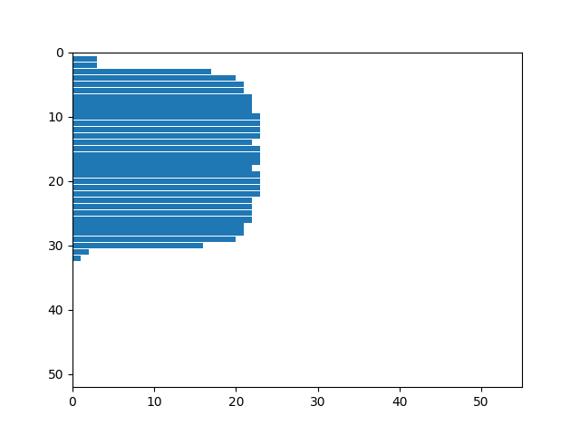

Признаки:
- Вес чёрного = 617.0
- Нормированный вес чёрного = 0.6427083333333333
- Центр масс = (15.272285251215559, 16.39546191247974)
- Нормированный центр масс = (0.4921477672832951, 0.49662780362837866)
- Моменты инерции = (39261.50729335495, 51942.256077795784)
- Нормированные моменты инерции = (20.40618882191006, 26.997014593448952)
