# Лабораторная работа №8. Текстурный анализ и контрастирование

d=2
phi = {45, 135, 225, 315}
AV
D
Степенное

## Кирпичная стена

### Исходное изображение, градации серого

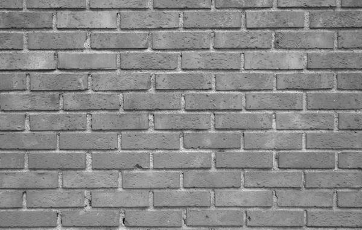

### Признаки

- Average Value (AV): 1.52587890625e-05
- Difference (D): 0.0010192285631083382

### Матрица Харалика

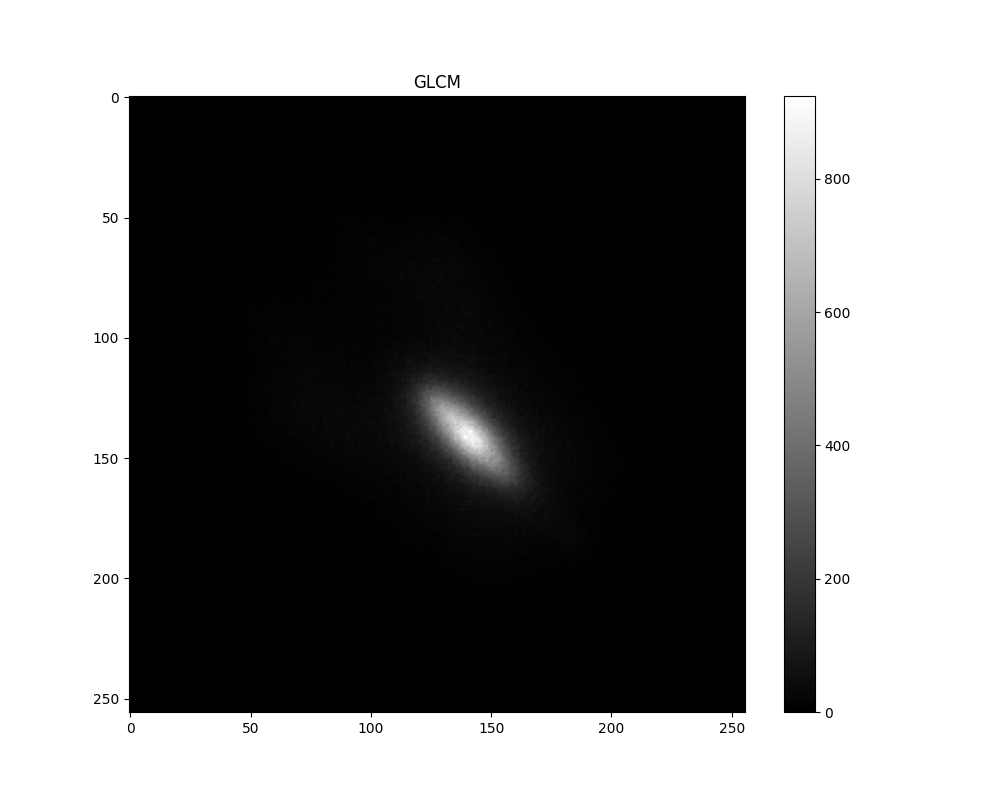

### Контрастированное изображение

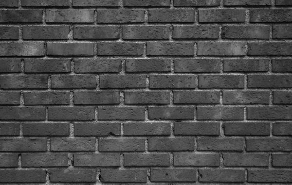

### Признаки

- Average Value (AV): 13.8331298828125
- Difference (D): 924

### Матрица Харалика

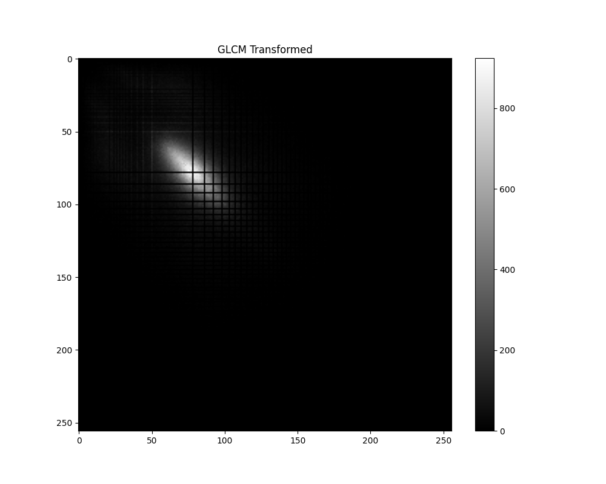

## Солнце

### Исходное изображение, градации серого

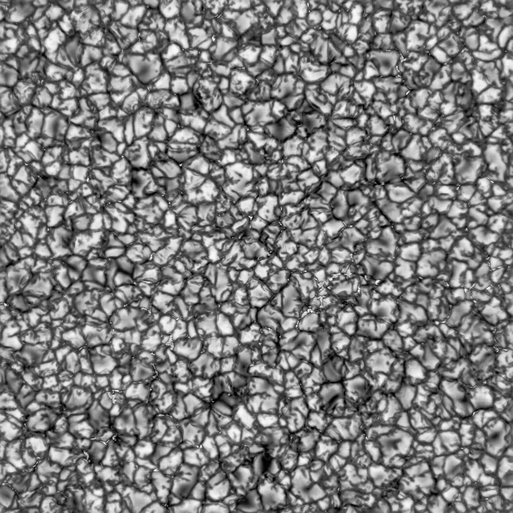

### Признаки

- Average Value (AV): 1.52587890625e-05
- Difference (D): 0.00034291781606883256

### Матрица Харалика

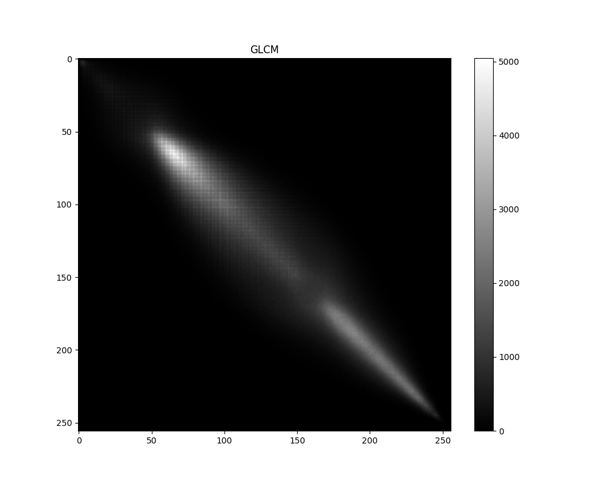

### Контрастированное изображение

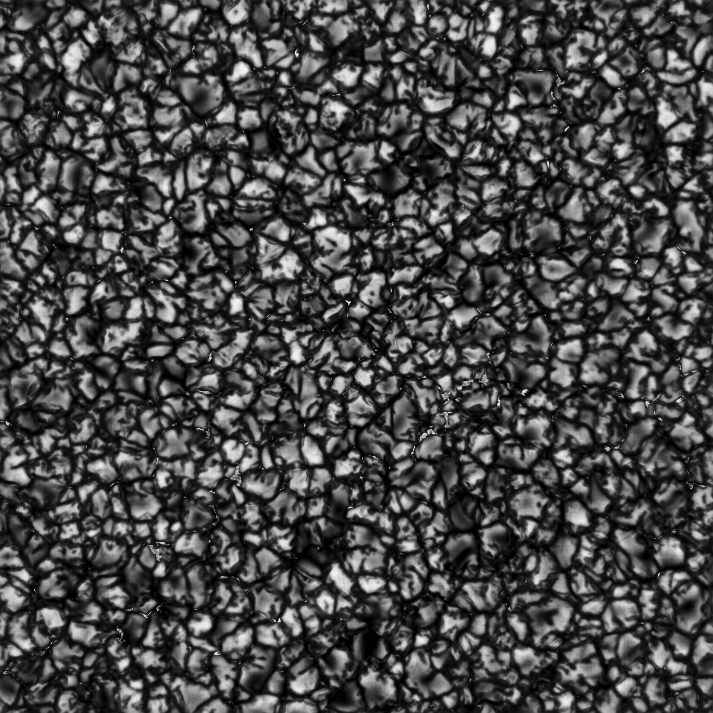

### Признаки

- Average Value (AV): 224.531494140625
- Difference (D): 49334

### Матрица Харалика

## Обои

### Исходное изображение, градации серого

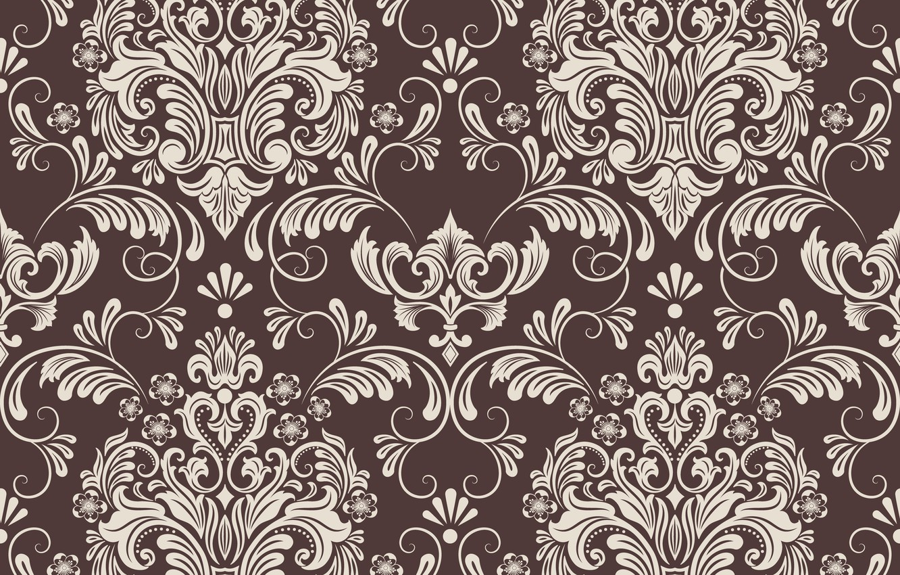
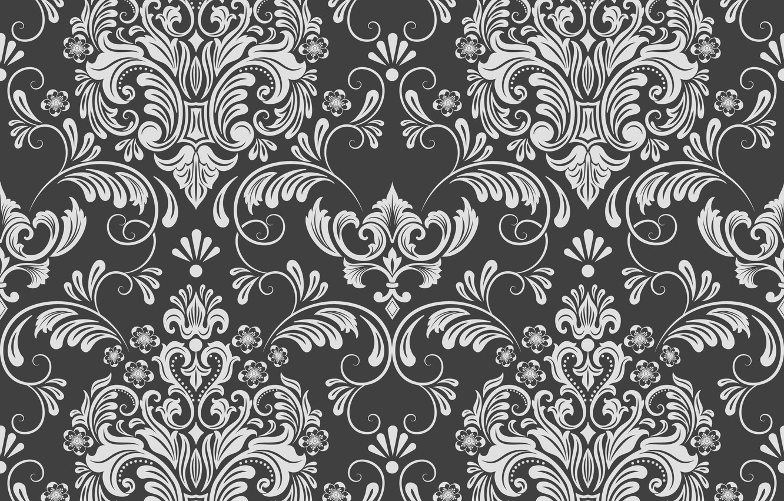

### Признаки

- Average Value (AV): 1.5258789062499998e-05
- Difference (D): 0.23619706695985246

### Матрица Харалика

### Контрастированное изображение

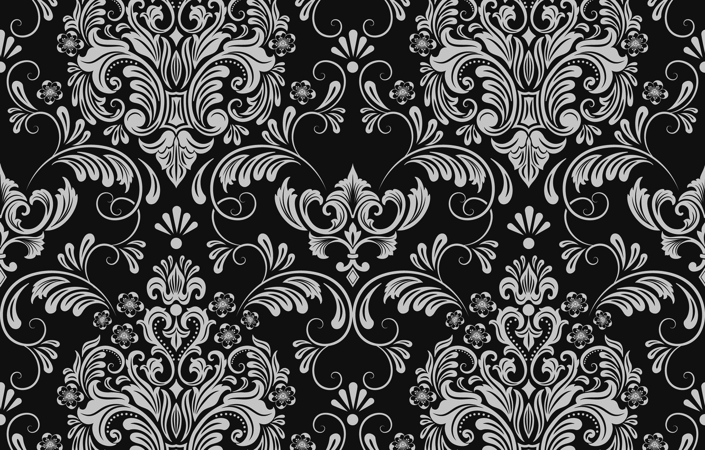

### Признаки

- Average Value (AV): 68.837890625
- Difference (D): 1167594

### Матрица Харалика

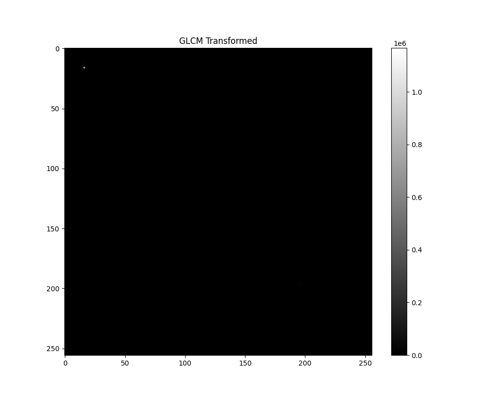